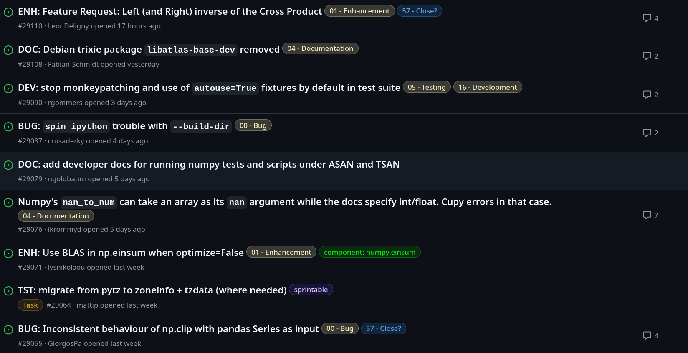
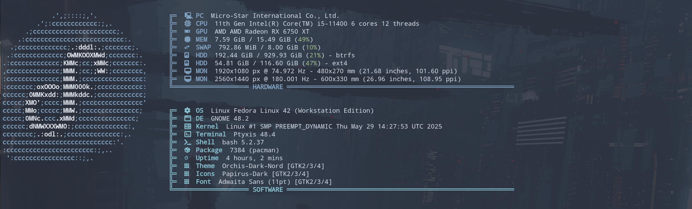
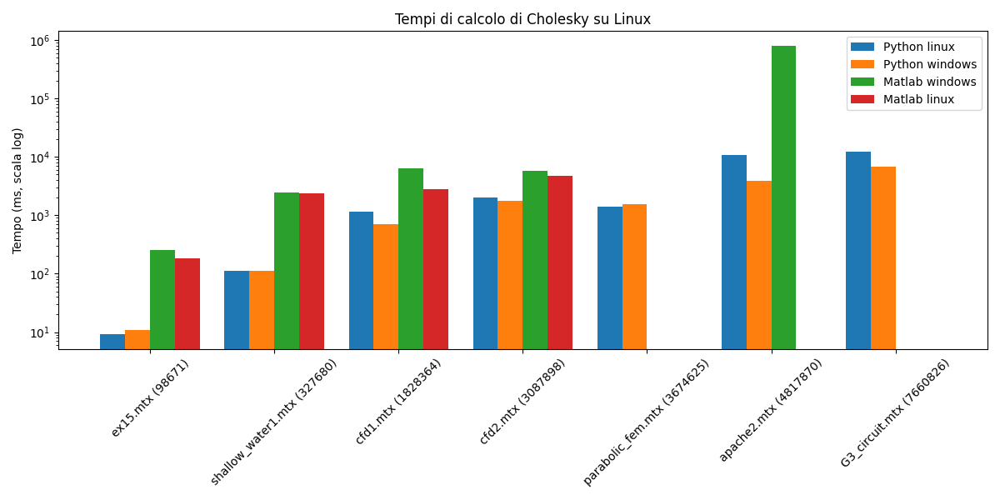
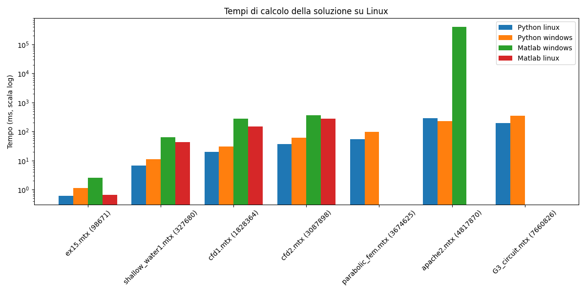
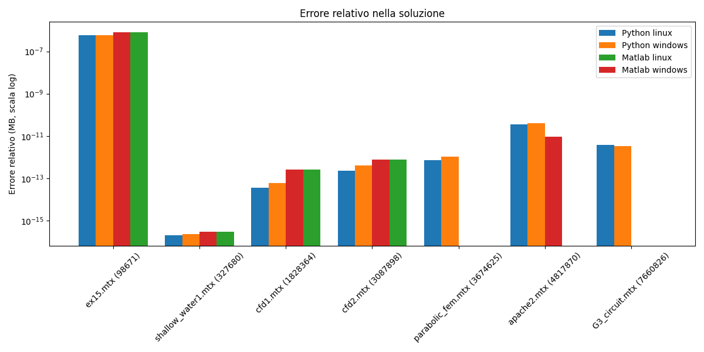
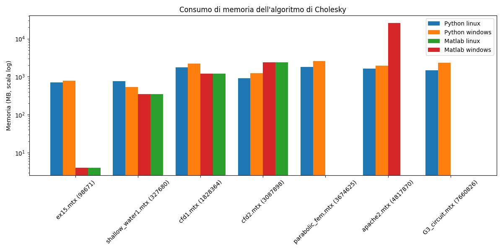
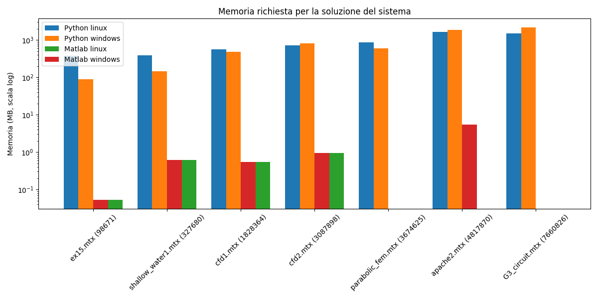

\renewcommand{\listfigurename}{Elenco delle figure}
\listoffigures
\newpage
\listoftables
\newpage


# Introduzione


## Scopo del progetto

L'obiettivo di questo progetto è di studiare l'implementazione del metodo di Cholesky in ambienti di programmazione opensource  per la risoluzioni di sistemi lineari con matrici sparse, simmetriche
e definite positive, e confrontarla con l'implementazione di MATLAB.
Tali matrici sono frequentemente utilizzate in molteplici applicazioni scientifiche e ingegneristiche, la loro risoluzione efficiente è fondamentale per garantine prestazioni elevate nei calcoli numerici.

In particolare, si vuole analizzare il comportamento dei solutori in base ai seguenti criteri:

- Il tempo di esecuzione;
- Precisione della soluzione;
- Uso della memoria;

Per ogni sistema operativo e ambiente di programmazione, verrà risolto un sistema lineare $Ax = b$, dove il termine noto $b$ è calcolato in modo tale che la soluzione esatta  sia il vettore $x_e$, composto da tutti gli elementi uguali a 1. \newline
I risultati verranno analizzati e comparati sulla base dei criteri persentati.

La relazione approfondisce le librerie opensource utilizzate e i risultati ottenuti con relativi grafici e un'analisi comparativa che evidenzia le differenze di prestazioni su entrambe le piattaforme.


 Le matrici del progetto  sono tutte  sparse, simmetriche e definite positive  e sono le seguenti:

- apache2
- cfd1;
- cfd2;
- ex15;
- G3_circuit;
- parabolic_fem;
- shallow_water1;
- Flan_1565;
- StocF-1465.

\newpage


## Matrici simmetriche e definite positive

### Matrici simmetriche

Una matrice si dice **simmetrica** è una matrice quadrata $A \in R^{n \times n}$ se:

$$A = A^t$$

Quindi la matrice è uguale alla sua trasposta, cioè tutti gli elementi sono $a_{ij} == a{ji}$.

### Matrici definite positve

Una matrice definita positiva è una matrice quadrata che soddisfa la seguente proprietà:

$$y^t Ax > 0, \space \forall y \in R^n \setminus \{0\}$$

quindi per ogni vettore colonna non nullo y, il prodotto scalare tra x, la matrice $A$ e $x$ trasposto, è strettamente positivo.

## Matrici sparse


Le matrici sparse sono matrici che contengono un gran numero di elementi uguali a zero. In molti casi, su ogni riga è presente solo un piccolo numero di elementi diversi da zero (ad esempio dell’ordine di 101101), indipendentemente dalla dimensione complessiva della matrice, che può arrivare anche all’ordine di 108108.

Numerosi problemi di calcolo scientifico si riducono alla risoluzione di uno o più sistemi lineari in cui la matrice dei coefficienti è sparsa. Un esempio notevole è rappresentato dai motori di ricerca sul web, che generano naturalmente matrici di dimensioni enormi e altamente sparse.

Per gestire efficientemente queste matrici, si adottano tecniche di **memorizzazione compatta**, evitando di conservare gli zeri. È sufficiente, infatti, registrare solo le informazioni relative agli elementi diversi da zero: la loro posizione (cioè gli indici ii e jj) e il valore a_{ij}. In questo modo si risparmia memoria e si migliorano le prestazioni dei calcoli.


## Metodi diretti e metodi iterativi

I metodi diretti e iterativi sono tecniche utilizzate per risolvere sistemi lineari del tipo $Ax=b$ in cui $A$ è una matrice quadrata e bb un vettore noto.  I metodi diretti forniscono la soluzione esatta del sistema in un numero finito di operazioni. Invece i metodi iterativi approssimano la soluzione attraverso una sequenza di vettori che converge alla soluzione satta x e si avvicinano progressivamente fino a quando l'errore è sufficientemente piccolo.


## Errore assoluto e relativo

### Errore assoluto

Data una soluzione esatta $x_e$ e una soluzione approssimata $x_h$ del sistema lineare $Ax =b$ l'errore assoluto è:


$$e_{ass} := ||x_h  - x_e||$$

dove $||\cdot||$ è una qualsiasi norma fra vettori.

## Errore relativo


Data una soluzione esatta $x_e$ e una soluzione approssimata $x_h$ del sistema lineare $Ax =b$ l'errore assoluto è:


$$e_{rel} := \frac{||x_h  - x_e||}{||x_e||}$$

dove $||\cdot||$ è una qualsiasi norma fra vettori.


## Cholesky


Cholesky è un metodo diretto che può essere usato solo su matrici simmetriche e positive.


# Matlab

Matlab è ambiente proprietario (non opensource) per il calcolo numerico e l'analisi statica scritto in C, creato da Mathworks.

Matlab offre un supporto nativo ed efficiente per le matrici sparse tramite la funzione `sparse`e internamente utilizza una rappresentazione chiamata **Compressed Sparse Column()**,
una struttura dati ottimizzata per l'accesso alle colonne di matrici sparse.
Questa rappresentazione memorizza soltanto gli elementi diversi da zero, insieme agli indici di riga e ai puntatori alle colonne, questo offre un risparmio di memoria e una maggiore efficienza su problemi di larga scala.

All'interno degli script sono state utilizzate funzioni interne di Matlab, tra cui `tic`  e `toc`:

```matlab
tic;
R = chol(A);
chol_time = toc *1000;
```

La funzione `tic` è l'istruzione che memorizza l'orario iniziale e `toc` calcola la differenza di tempo da quando è stata chiamata `tic` e lo restituisce in secondi e per convertirlo è sufficiente
moltiplicarlo per per mille. Con la funzione non viene calcolato il `cpuTime`, ma il tempo reale dell'esecuzione dello script.

Oltre alla funzione tic all'interno del benchmark è presente la funzione `whos()`:

```matlab
x = R\(R'\b);
sol_info = whos('x');
```

Si tratta di uno strumento di diagnostica integrato in MATLAB che fonisce delle informazioni sulle variabili:

- nome della variabile, come è stata definita nello script;
- dimensione, espresse come righe per colonne ($r \times c$);
- Bytes, la quantità di memoria (in byte) occupata dalla variabile in RAM;
- Classe, il tipo di dato della variabile;
- Attributi, attributi speciali legati alla variabile (come global, persistent e sparse);

Nello script è stato utilizzato il campo Bytes restituito dalla funzione whos per determinare la quantità di memoria occupata in RAM dalle variabili durante l'esecuzione.
Questo campo indica, per ciascuna variabile presente nello script, lo spazio (in byte) effettivamente utilizzato.
L'analisi del campo Bytes è utile per valutare l'efficienza in termini di memoria del codice, specialmente in presenza di matrici di grandi dimensioni, strutture dati complesse o elaborazioni iterative su grandi dataset.
Monitorare il consumo di memoria permette inoltre di ottimizzare le prestazioni e prevenire eventuali problemi legati a limiti di memoria, soprattutto in ambienti a risorse limitate.

### Lettura di file Matrix Market format

Il formato **Matrix market format** è il formato di file standard per la rappresentazione di matrici sparse, ma non è supportato nativamente da Matlab.
Per importare le matrici con il seguente formato, è possibile utilizzare la funzione  nel sito  [https://math.nist.gov/MatrixMarket/mmio/matlab/mmiomatlab.html](https://math.nist.gov/MatrixMarket/mmio/matlab/mmiomatlab.html) che risolve il problema, offrendo il codice di una funzione chiamata `mmread`. In questo link sono presenti altre funzioni che non sono stati utilizzati all'interno del progetto che hanno lo scopo di dare un supporto completo
a questo formato.

### Script completo


Lo script estrae dalla cartella **Matrici** tutti i file con estensione **.mtx** e i loro relativi nomi, inizializza un array della stessa lunghezza del numero di file trovati, che conterrà i dati delle matrici.

```matlab
matrixFiles = dir('Matrici/*.mtx');
matrixNames = {matrixFiles.name};
results = cell(length(matrixNames), 1);
```

Per ogni matrice, lo script carica i file contenuti nella cartella **Matrici** con la funzione `mmread` (come descritto nella sezione [Lettura di file Matrix Market](#lettura-di-file-matrix-market-format). Viene quindi  creato il vettore soluzione esatta `xe`, formato da elementi tutti uguali a 1, la cui lunghezza è pari al numero di righe della matrice `A`.

Il termine noto `b` è calcolato  come prodotto tra la matrice `A` e il vettore `xe`. Successivamente, lo script utilizza la funzione `chol` per eseguire la fattorizzazione di Cholesky sulla matrice `A`, eseguendo i benchmark relativi a tempo di calcolo, errore e uso della memoria per ciascuna matrice.

```matlab
for i = 1:length(matrixNames)
    [A,rows,cols,entries,rep,field,symm]  = mmread(fullfile('Matrici', matrixNames{i}));
    xe = ones(1,cols);
    b = A * xe';
    tic;
    R = chol(A);
    chol_time = toc *1000;
    chol_info =  whos('R');
    tic;
    x = R\(R'\b);
    sol_time = toc * 1000;
    sol_info = whos('x');
    error = norm(x-xe') / norm(xe');
    [m, n] = size(A);

    results{i} = {matrixNames{i},m,chol_time,chol_info.bytes / (1024^2), sol_time,sol_info.bytes / (1024^2), error};
end
```


I risultati del benchmark vengono salvati in un file, in cui ogni riga rappresenta il risultato associato a una specifica matrice.  Il nome del file può essere `matlab_linux_output_data.csv`, se lo script viene eseguito su linux, oppure `matlab_windows_output_data.csv`, se  viene eseguito su windows.


```matlab
% Prepare the output data
outputData = { 'Matrix Name', 'Matrix size', 'Cholesky Time (ms)', 'Cholesky info', 'Solution Time (ms)', 'Solution Info ','Error'; };

% Append results to outputData
for i = 1:length(results)
    outputData = [outputData; ...
                    results{i}];
end

if isunix
    filename = 'matlab_linux_output_data.csv';
elseif ispc
    filename = 'matlab_windows_output_data.csv';
end

% Open the file for writing
fileID = fopen(filename, 'w');

% Write the data to the file
for row = 1:size(outputData, 1)
    fprintf(fileID, '%s,', outputData{row, :});
    fprintf(fileID, '\n');
end

% Close the file
fclose(fileID);a
```


# Python

Uno degli ambienti opensource che verrà utilizzato è Python, si tratta di  un linguaggio di programmazione ad alto livello, interpretato che offre vantaggi sulla semplicità, portabilità e una vasta libreria che permette
di effettuare operazioni riguardo lo sviluppo web, all'analisi dei dati, alla robotica e all'intelligenza artificiale.
Tra le librerie più utilizzate per   le matrici è presente numpy e scipy che verranno approfondite successivamente.

## Descrizione delle librerie utilizzate

Le principali librerie utilizzate sono `numpy`, `scipy` e `scikit-sparse`. Queste librerie sono legate tra loro e utilizzano le loro funzionalità, come approfondito successivamente. Oltre a queste librerie, utilizzate per l'implementazione dell'algoritmo, è stata utilizzata un ulteriore libreria chiamata `memory_profiler`.

### Numpy

E' la libreria opensource fondamentale per il calcolo scientifico, introduce una struttura dati `ndarray` che sono più efficienti rispetto alle liste di python.
Permette di svolgere operazioni vettorali e matriciali con altre prestazioni, grazie alla compatibilità con librerie C/C++, inoltre offre anche la compatibilità con più librerie.

Essendo una libreria opensource, è possibile vedere il codice all'interno del seguente [link](https://github.com/numpy/numpy), in cui sono presenti tutte le informazioni aggiuntive riguardo la libreria.
E' importante far notare che la libreria ha **38.975 commits**, con una frequenza  settimanale e  con un vasto numero di sviluppatori nella community che aiutano a risolvere i problemi nella sezione Issues in tempi molto
brevi.



### SciPy

SciPy è un'altra libreria opensource che espande le funzionalità di **Numpy** per il calcolo scientifico, offrendo quidni anche funzioni matematica di livello più avanzato.
I moduli principali sono:

- `scipy.linalg`, per algebra lineare avanzata;
- `scipy.otimize`, per ottimizzazione numerica;
- `scipy.fftpack` per trasformate di Fourier;
- `scipy.sparse` supporto per matrici sparse.

I moduli utilizzati in questo progetto sono `scipy.linalg` e `scipy.sparse`, considerando che `linalg` offre funzioni come il calcolo della norma, necessario per il calcolo dell'errore
relativo, invece `scipy.sparse` contiene diversi formati che permettono di ottimizzare operazioni con matrici sparse. Il formato utilizzato con `cholesky` è lo stesso usato nativamente da Matlab e si tratta
di **CSC** (Compressed Sparse Compressed), che contiene tutti i valori non nulli (quindi diversi da zero) e gli indici di riga dei valori non nulli.

Anche scipy è una libreria con una community molto attiva con commits molto frequenti, attualmente nel progetto ci sono in totale **35.371 commits** , con una community che risolve i problemi settimanalmente.


### scikit-sparse

**Scikit-sparse** è una libreria che estende le funzionalità di SciPy per il trattamento efficiente di matrici sparse. Alla base dei suoi algoritmi vi è CHOLMOD, una libreria C++ specializzata nella fattorizzazione di Cholesky, particolarmente ottimizzata per matrici sparse. Rispetto alle implementazioni offerte da NumPy e SciPy, CHOLMOD risulta significativamente più efficiente in questo ambito.

La community di sviluppo di Scikit-sparse è meno attiva rispetto a quelle di SciPy e NumPy, poiché la libreria si limita principalmente a fornire un'interfaccia Python alla fattorizzazione di Cholesky offerta da CHOLMOD, senza introdurre algoritmi propri. Tuttavia, il progetto è ancora mantenuto e rappresenta una soluzione valida per chi necessita di prestazioni elevate nella risoluzione di sistemi lineari sparsi simmetrici e definiti positivi.


### Memory profiler

Memory profiler è una libreria di python che permette di monitorare il consumo di memoria di processo, quindi facendo un analisi linea per linea di consumo di memoria.

## Script completo

Lo script inizializza le diverse dipendenze con i metodi dalle librerie presentate in precedenza e altre che fanno parte delle librerie native di Python.

```python
import os
import numpy as np
import time
import scipy.linalg as lg
from scipy.io._fast_matrix_market import mmread
from sksparse.cholmod import cholesky
from memory_profiler import memory_usage
```

Due metodi vengono definiti utilizzati per essere utilizzati sucessivamente per calcolare la memoria utilizzando `memory_usage`.

```python
def run_cholesky(A):
    return cholesky(A)

def run_solver(R, b):
    return R(b)
```

Viene inizializzato il nome del file di output che cambia sulla base del sistema operativo utilizzato e vengono estratti dalla directory `"Matrici/"` tutti i file di tipo mtx.
E nel file di output viene salvata la prima riga dell'intestazione, per definire sucessivamente i risultati.

```python
file_names =  os.listdir("Matrici/")
output_filename =  'linux_output_result.csv' if os.name == 'posix' else "windows_file_result.csv"
data_to_save = open(output_filename,'w')
data_to_save.write("Matrix Name,Matrix size,Cholesky Time (ms),Cholesky Memory,Solution Time (ms), Solution memory,Error\n")
```

Ogni matrice viene convertita a una matrice di tipo **CSC** (spiegata nel capitolo dedicato a [Scipy](#scipy) ), per poterla utilizzare con  la funzione `cholesky` della libreria scikit-sparse sucessivamente.
La soluzione esatta  `xe` viene inizializzata con la stessa dimensione della matrice,  viene calcolata `b` in modo che `xe` sia la soluzione esatta di `Ax = b`.
Sia cholesky che la soluzione vengono eseguite 2 volte, la prima per registrare la loro memoria tramite `memory_usage` e la seconda per il tempo di esecuzione tramite `time.perform_counter()` e convertito in ms.


```python
for file_name in file_names:
    A =  mmread(f"Matrici/{file_name}")
    A = A.tocsc()
    xe = np.ones(A.shape[0])
    b = A @ xe
    cholesky_mem, R = memory_usage((run_cholesky, (A,)), retval=True, max_usage=True, interval=0.01)
    R = cholesky(A)
    elapsed_time_cholesky = (time.perf_counter() - start_time) * 1000
    solution_mem, x = memory_usage((run_solver, (R, b)), retval=True, max_usage=True, interval=0.01)
    start_time = time.perf_counter()
    x = R(b)
    elapsed_time_solution= (time.perf_counter() - start_time) * 1000
    error = lg.norm(x - xe) / lg.norm(xe)
    data_to_save.write(f"{file_name},{A.shape[0]},{elapsed_time_cholesky},{cholesky_mem},{elapsed_time_solution},{solution_mem},{error}\n")
    print(f"{file_name} processed...")
```


**Script completo:**

```python
import os
import numpy as np
import time
import scipy.linalg as lg
from scipy.io._fast_matrix_market import mmread
from sksparse.cholmod import cholesky
from memory_profiler import memory_usage

def run_cholesky(A):
    return cholesky(A)

def run_solver(R, b):
    return R(b)

def main():
    file_names =  os.listdir("Matrici/")
    output_filename =  'linux_output_result.csv' if os.name == 'posix' else "windows_file_result.csv"
    data_to_save = open(output_filename,'w')
    data_to_save.write("Matrix Name,Matrix size,Cholesky Time (ms),Cholesky Memory,Solution Time (ms), Solution memory,Error\n")
    for file_name in file_names:
        A =  mmread(f"Matrici/{file_name}")
        A = A.tocsc()
        xe = np.ones(A.shape[0])
        b = A @ xe
        cholesky_mem, R = memory_usage((run_cholesky, (A,)), retval=True, max_usage=True, interval=0.01)
        start_time = time.perf_counter()
        R = cholesky(A)
        elapsed_time_cholesky = (time.perf_counter() - start_time) * 1000
        solution_mem, x = memory_usage((run_solver, (R, b)), retval=True, max_usage=True, interval=0.01)
        start_time = time.perf_counter()
        x = R(b)
        elapsed_time_solution= (time.perf_counter() - start_time) * 1000
        error = lg.norm(x - xe) / lg.norm(xe)
        data_to_save.write(f"{file_name},{A.shape[0]},{elapsed_time_cholesky},{cholesky_mem},{elapsed_time_solution},{solution_mem},{error}\n")
        print(f"{file_name} processed...")

if __name__ == '__main__':
    main()
```


# Risultati


## Specifiche hardware


Prima di presentare i risultati relativi ai test eseguiti su entrambi i sistemi operativi, la figura \ref{fig:hardware_specs} mostra le specifiche hardware del computer utilizzato per le prove.

È importante sottolineare che i due sistemi operativi, Windows e Linux, sono stati installati in dual boot e non eseguiti tramite macchina virtuale. Questa scelta è stata fatta per garantire misurazioni affidabili e realistiche, evitando l’introduzione di overhead o limitazioni dovute alla virtualizzazione, che potrebbero falsare i tempi di esecuzione o il consumo di risorse.

L’ambiente di test così configurato consente di confrontare in modo diretto e imparziale il comportamento dei software MATLAB e Python in condizioni operative il più possibile equivalenti dal punto di vista dell’hardware.





Fedora è una distribuzione moderna e open source del sistema operativo Linux, sviluppata dalla comunità Fedora Project e sponsorizzata da Red Hat, azienda leader nel settore dell’open source enterprise.

È particolarmente apprezzata per la sua capacità di integrare rapidamente le tecnologie open source più recenti, fungendo spesso da banco di prova per soluzioni che verranno poi adottate in Red Hat Enterprise Linux (RHEL). Nonostante il suo orientamento all’innovazione, Fedora mantiene un elevato livello di stabilità, sicurezza e affidabilità, rendendola adatta sia per l’uso personale che per lo sviluppo software e l’ambiente accademico.

Fedora si distingue inoltre per il suo ciclo di rilascio regolare e prevedibile, la gestione dei pacchetti tramite il gestore dnf, e il forte rispetto per i principi di software libero. È disponibile in diverse edizioni (Workstation, Server, IoT, Silverblue, ecc.), ciascuna ottimizzata per un ambito specifico.

## Matrici supportate

Non tutte le matrici sono state eseguite perché la memoria della macchina non è sufficiente.

### Matlab

Table:  Tabella matrici supportate in Matlab su Windows e Linux

| Matrici           | Windows                       | Linux                        |
| ----------------- | ---------------------------   | ---------------------------- |
| apache2           |    \color{green}\ding{51}     |   \color{red}\ding{55}       |
| cfd1              |    \color{green}\ding{51}     |   \color{green}\ding{51}     |
| cfd2              |    \color{green}\ding{51}     |   \color{green}\ding{51}     |
| ex15              |    \color{green}\ding{51}     |   \color{green}\ding{51}     |
| G3_circuit        |    \color{red}\ding{55}       |   \color{red}\ding{55}       |
| parabolic_fem     |    \color{red}\ding{55}       |   \color{red}\ding{55}     |
| shallow_water1    |    \color{green}\ding{51}     |   \color{green}\ding{51}     |
| Flan_1565         |    \color{red}\ding{55}       |   \color{red}\ding{55}       |
| StocF-1465        |    \color{red}\ding{55}       |   \color{red}\ding{55}       |


Nella tabella sono elencate tutte le matrici supportate e non supportate da MATLAB. Tra i due sistemi operativi analizzati, l’unica differenza significativa riguarda la matrice `apache2`, che risulta eseguibile solo su Windows.

Questo comportamento è dovuto alla diversa gestione della memoria tra Windows e Linux. In particolare, Windows utilizza file di paging: porzioni di spazio su disco destinate a estendere virtualmente la memoria RAM disponibile quando quest’ultima è insufficiente. In pratica, quando la RAM fisica si esaurisce, il sistema operativo sposta temporaneamente parte dei dati meno utilizzati nel file di paging, creando un’area di memoria "simulata".

Questa tecnica consente a MATLAB su Windows di caricare ed eseguire matrici di dimensioni maggiori rispetto alla memoria fisica disponibile. Tuttavia, l’uso del disco come memoria virtuale comporta un significativo rallentamento delle prestazioni, poiché l'accesso al disco è molto più lento rispetto alla RAM. Questo è evidente nei risultati prestazionali riportati successivamente, dove l'esecuzione della matrice apache2 su Windows mostra tempi sensibilmente più lunghi rispetto alle altre.

In contrasto, Linux tende a essere più conservativo nella gestione della memoria, evitando l’uso eccessivo di swap su disco, motivo per cui la stessa matrice apache2 potrebbe non essere eseguibile su quel sistema, soprattutto in ambienti con RAM limitata.


\newpage

### Linux

Table:  Tabella matrici supportate in Python su Windows e Linux

| Matrici           | Windows                       | Linux                        |
| ----------------- | ---------------------------   | ---------------------------- |
| apache2           |    \color{green}\ding{51}     |   \color{green}\ding{51}     |
| cfd1              |    \color{green}\ding{51}     |   \color{green}\ding{51}     |
| cfd2              |    \color{green}\ding{51}     |   \color{green}\ding{51}     |
| ex15              |    \color{green}\ding{51}     |   \color{green}\ding{51}     |
| G3_circuit        |    \color{green}\ding{51}     |   \color{green}\ding{51}     |
| parabolic_fem     |    \color{green}\ding{51}     |   \color{green}\ding{51}     |
| shallow_water1    |    \color{green}\ding{51}     |   \color{green}\ding{51}     |
| Flan_1565         |    \color{red}\ding{55}       |   \color{red}\ding{55}       |
| StocF-1465        |    \color{red}\ding{55}       |   \color{red}\ding{55}       |

Per quanto riguarda Python, le matrici supportate sono le stesse su entrambi i sistemi operativi, grazie all’utilizzo della libreria **CHOLMOD**, che gestisce la memoria in modo più efficiente rispetto ad altri ambienti. Inoltre, a differenza di MATLAB, in Python non è necessario mantenere aperto l’intero ambiente per eseguire uno script, il che consente un utilizzo più flessibile e leggero delle risorse di sistema.

Questa gestione più efficiente fa sì che le matrici supportate in Python non consumino tutta la memoria RAM disponibile durante l’esecuzione. Tuttavia, su sistemi Windows, anche con Python, è possibile che il limite della memoria fisica venga raggiunto. Come già spiegato in precedenza, Windows utilizza i file di paging e porzioni di disco dedicate a estendere virtualmente la RAM per compensare la carenza di memoria fisica, permettendo così di eseguire operazioni su matrici di grandi dimensioni a costo di un rallentamento nelle prestazioni.

In sintesi, grazie a una gestione più efficiente della memoria e all’architettura di esecuzione più leggera, Python risulta meno vincolato dalla quantità di RAM disponibile rispetto a MATLAB, anche se il meccanismo di paging su Windows può comunque influire sulle prestazioni in presenza di grandi dataset.


## Risultati tempo

L'ordine dei grafici si basa sul numero di elementi non zero della matrice, che è possibile vedere vicino al nome.




Nella figura \ref{chol_time} è rappresentato il grafico del tempo di esecuzione della decomposizione di Cholesky su Windows e Linux, utilizzando sia MATLAB che Python.

Dalla rappresentazione emergono diverse osservazioni. Quando si utilizza Python su entrambi i sistemi operativi, i tempi di esecuzione sono simili, con lievi differenze: per alcune matrici il tempo richiesto è inferiore su Linux, mentre per altre è più basso su Windows.

Un’altra osservazione riguarda la differenza di velocità tra MATLAB e Python. MATLAB risulta generalmente più lento, e questa differenza si accentua notevolmente nel caso della matrice apache2.mtx. Questo comportamento è legato a quanto spiegato nel paragrafo sulle matrici supportate di MATLAB, in particolare all’uso dei file di paging su Windows. Quando la RAM viene completamente utilizzata, il sistema operativo utilizza lo spazio su disco (SSD, NVMe o HDD) come memoria virtuale, causando un calo delle prestazioni e un conseguente aumento del tempo di esecuzione.



Nel grafico \ref{sol_time}, che mostra il tempo di esecuzione per la risoluzione di sistemi lineari, si possono osservare conferme alle stesse considerazioni fatte in precedenza riguardo alla decomposizione di Cholesky.

In particolare, anche in questo caso Python mostra prestazioni molto simili su entrambi i sistemi operativi, con differenze temporali contenute e non sistematiche: alcune matrici vengono risolte più rapidamente su Linux, altre su Windows.

Al contrario, MATLAB evidenzia una maggiore variabilità nelle prestazioni, soprattutto in corrispondenza della matrice apache2.mtx. Come già discusso, questo rallentamento è dovuto all’uso del file di paging su Windows quando la RAM disponibile si esaurisce, con conseguente ricorso alla memoria su disco, più lenta.

Questa situazione provoca un aumento significativo del tempo di soluzione del sistema lineare, sottolineando come la gestione della memoria e l’efficienza dell’ambiente di esecuzione siano fattori critici nel trattamento di matrici di grandi dimensioni.

## Risultati errore




L’errore relativo delle soluzioni, mostrato nella figura \ref{error_fig}, evidenzia che non ci sono differenze sostanziali tra i diversi linguaggi di programmazione utilizzati. In altre parole, sia MATLAB che Python forniscono soluzioni con livelli di errore simili, il che indica una buona coerenza numerica tra i due ambienti.

Un’eccezione si osserva nel caso della matrice `ex15.mtx`, per la quale l’errore relativo risulta sensibilmente più elevato. Questo comportamento è probabilmente dovuto al fatto che la matrice è mal condizionata, rendendo la soluzione meno accurata rispetto agli altri casi.

## Risultati memoria








E' importante sottolineare che non è possibile effettuare un confronto diretto e assoluto del consumo di memoria tra MATLAB e Python, poiché i due ambienti utilizzano strategie differenti di gestione e allocazione della memoria. MATLAB tende a mantenere in memoria l'intero ambiente, compresi i dati temporanei e le variabili globali.

Dalle figure si può osservare che  Linux consuma generalmente meno memoria rispetto a Windows, soprattutto con matrici di grandi dimensioni. In particolare, MATLAB mostra un aumento significativo nell'utilizzo della memoria man mano che cresce la dimensione delle matrici.

Inoltre, l’utilizzo di un sistema operativo Linux rispetto a Windows comporta ulteriori vantaggi. Linux, grazie alla sua natura open source e alla minore presenza di processi e servizi in background, offre una gestione delle risorse più snella. La gestione della memoria virtuale in Linux è nota per essere particolarmente efficiente, con meccanismi avanzati di caching e rilascio che aiutano a contenere l’uso della RAM e migliorano le prestazioni complessive, specialmente in operazioni numeriche intensive.

# Conclusioni

In conclusione, i risultati ottenuti mettono in evidenza che esistono alcune differenze tra le varie soluzioni adottate, ma tutte si sono dimostrate valide e affidabili. Sia l'utilizzo di software proprietario che di software open source ha prodotto risultati comparabili, senza scostamenti significativi nei principali aspetti analizzati, come errore relativo, memoria tempo di esecuzione.


Questo conferma che utilizzare le alternative opensource (come Python e Linux) rappresentano una scelta concreta e sostenibile, sia dal punto di vista tecnico che economico, e possono essere adottate con fiducia anche in contesti professionali o accademici dove si richiede rigore e precisione.
